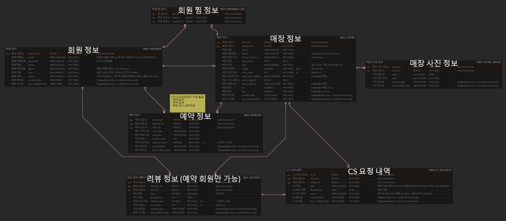

# 놀(고) 먹(고) 자(고) - Renewal

### 기존 프로젝트
- https://github.com/giibeom/project-NMJ

<br>

### Github 전략 (Git Flow)

---

#### Branch 구조
```markdown
|-- master
|   |-- hotfix
|   |   |-- issue-#885-user-deleted-error
|-- develop
|   |-- feat
|   |   |-- issue-#883-user-update
|   |   |-- issue-#884-user-delete
|   |-- refactor
|   |   |-- issue-#887-user-refactoring
```

#### Branch merge
> merge 시 커밋 scope에는 `PR 번호`를 넣습니다.

- `feat/refactor -> develop` : **Squash and Merge**
  - merge commit message => `feat(#2): 사용자 등록 기능을 추가한다`
- `hotfix -> main` : **Squash and Merge**
  - merge commit message => `fix(#2): 예약 시 매장 회원에게 승인 요청이 안가는 오류를 수정한다`
- `develop -> main` : **Rebase and Merge**
  - merge commit message => `merge(#2): 백엔드 프로젝트를 생성한다`

#### Commit Convention
> 로컬에서의 커밋 scope에는 `Issue 번호`를 넣습니다. 

|    타입    |                 설명                 |                    예시                     |
|:--------:|:----------------------------------:|:-----------------------------------------:|
|  merge   |              PR merge              |         merge(#2): 백엔드 프로젝트를 생성한다         |
|   feat   |             새로운 기능 추가              |         feat(#3): 사용자 등록 기능을 추가한다         |
|   fix    |               버그 수정                | fix(#3): 예약 시 매장 회원에게 승인 요청이 안가는 오류를 수정한다 |
| refactor |              코드 리팩토링               |    refactor(#3): 예약 비즈니스 로직 리팩토링을 진행한다    |
|   test   |             테스트 코드 작성              |         test(#3): 예약 실패 케이스를 추가한다         |
|   docs   |               문서 수정                |         docs(#3): README에 ERD를 추가한다         |
|  chore   | 빌드 업무, 패키지 매니저 수정 등 (소스 코드 외적인 작업) |            chore: PR 템플릿을 생성한다            |


<br>

### 데이터베이스 ERD
- https://www.erdcloud.com/d/uykGfNjFfDtZDvzpk


#### 1차 스프린트


